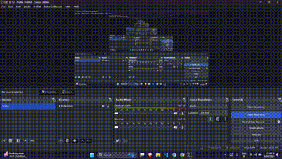

# Sketcher

### Collaborative Paint

Hello from Collaborative Paint, an innovative platform that changes the way we work together on artwork. This app promotes creativity and collaboration by enabling multiple people to collaborate in real-time on one online canvas.

## Demo



## Features

- 🖼️ **Real-Time Collaboration**: Multiple users can paint together on a single canvas, making it perfect for team projects, educational purposes, and fun group activities.
- 🔗 **Easy Sharing**: Generate a unique link and ID for each project, making it simple to invite others to join and contribute.
- 🖥️ **Intuitive Interface**: User-friendly design ensures that everyone, regardless of their artistic skills, can enjoy and contribute to the painting process.
- 🎨 **Versatile Tools**: A variety of brushes, colors, and effects to unleash your creativity.

## Getting Started

Follow these instructions to set up and start using Collaborative Paint.

### Prerequisites

Make sure you have the following installed:

- [Flutter](https://flutter.dev/) (version 2.x or higher)
- [Dart](https://dart.dev/) (version 2.x or higher)

### Installation

1. **Clone the repository:**

   ```bash
   git clone https://github.com/yagnesh0312/sketcher.git
   cd sketcher
   ```

2. **Install dependencies:**

   ```bash
   flutter pub get
   ```

3. **Run the application:**

   ```bash
   flutter run
   ```

4. **Open your browser and navigate to:**
   ```
   http://localhost:3000
   ```

## Usage

1. **Create a New Project:**

   - Open the application in your browser.
   - Click on the "Create New Project" button.
   - Share the generated link and project ID with collaborators.

2. **Join an Existing Project:**
   - Open the application in your browser.
   - Enter the project ID provided by the creator.
   - Start painting together!
